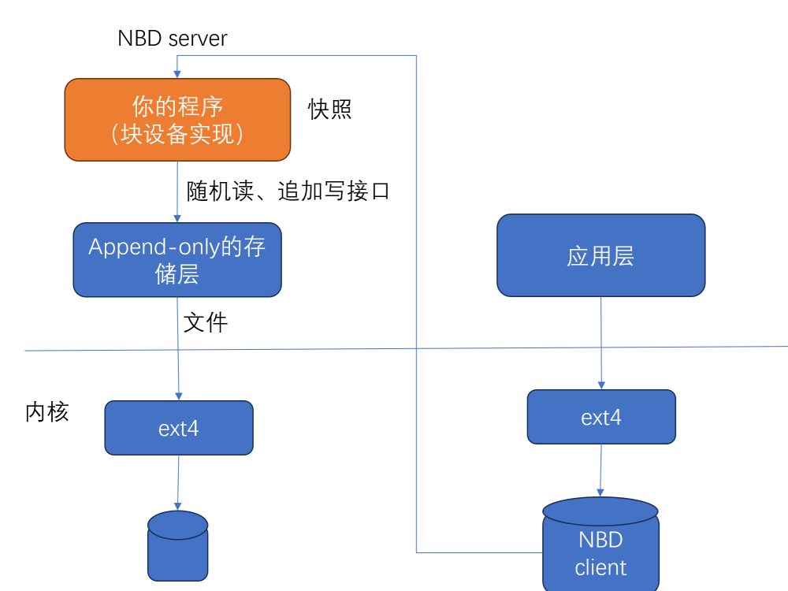

# BDEV: 基于Append-Only存储实现的块设备

## 1. 背景

这是一个用于学习存储技术练习项目。Append-Only语义的接口，在存储系统中很常见。
但是很多上层应用不能直接使用Append-Only语义的存储接口，一般要求update-in-place
接口。则就需要把append-only接口转换成update-in-place接口，或者说，基于append-only
接口实现update-in-place接口。

Append-only接口指的是，只能在文件或者对象尾部添加数据，已经写入了文件或者对象的
数据，不能修改，只能把文件或者对象整个删除掉才能释放已经占用空间。append-only的
文件或者对象，支持随机读，也就是可以读取任何位置的数据。update-in-place接口，则
可以修改文件和对象中任何位置的数据。

Flash芯片的特性就跟Append-only语义很接近。Flash芯片只能以block为单位进行擦除，
通常一个block是64KB、128KB、256KB，甚至1MB。每次擦除之后，Flash芯片的这个block
可以被改写一次，改写的单位是page，通常是4KB或者8KB。一旦被改写，则不能再次被
改写，再次改写之前，必须先对整个block执行擦除操作。擦除操作性能开销很大。
基于flash的这些特性，可以很容易实现append-only接口。但是要实现update-in-place
接口，则没那么容易。SSD盘内部的FTL软件，一个主要功能就是实现append-only和
update-in-place之间的转换。

最近存储行业提出了ZNS接口的SSD盘，这个ZNS接口就是append-only语义的接口。
由于上层应用更多使用update-in-place接口，例如：POSIX文件接口、SCSI/NVMe等块设备
接口，或者KV数据库接口，等等。因此就需要，在ZNS接口上要实现update-in-place接口
语义的接口，块设备接口、POSIX文件接口、或者KV接口。

另外，很多分布式存储系统的存储层接口，也是Append-Only语义的。例如，阿里云的Pangu，
微软的WAS，谷歌的GFS等等，也需要基于Append-Only语义接口要实现块设备接口，文件
接口等。例如，阿里云的块存储服务EBS是基于Pangu的Append-only接口实现的。

对于存储行业研发人员来说，基于Append-only语义存储接口，如何实现update-in-place
接口，已经是必备知识了。

## 2. BDEV

如下图所示，BDEV是一个基于append-only接口实现的nbd server。通过Linux内核的nbd
client可以链接到这个nbd server上，就可以看到Linux主机上增加了一个新的块设备
/dev/nbd0，然后可以在这个块设备上创建文件系统，挂载这个块设备。

BDEV中nbd-server协议层代码，直接用[go-nbd](https://github.com/pojntfx/go-nbd)的
实现。块设备本身Write-in-place的语义，bdev/bd这个目录中的源码实现的。几个子目录
中源码功能如下：

* 主目录 - main.go, nbd-server.go，这两个是程序入口，也是nbd-server的主循环。
* aof - 这里面是一个append-only语义的文件接口
* bd - 这里面实现了一个简化的LSM Tree，也就是基于append-only接口实现了块设备所
  需的update-in-place接口。
* backend - 这里面是nbd-server需要的存储后端接口。这里面的代码没有实际功能，
  只是负责bd里面的update-in-place接口跟nbd-server需要的接口粘合起来。




## 3. 底层append-only接口(AOF)

用golang描述的底层append-only接口如下

```golang
//append-only对象的定义
type AOF struct {
        f *os.File
}

//对已经存在的AOF文件，用open打开
func Open(name string) (a *AOF, err error)

//对不存在的AOF文件，用Create创建
func Create(name string) (a *AOF, err error)

//返回AOF的属性
func Stat(name string)(fi os.FileInfo, err error)

//AOF文件属性包括下面一些信息
type FileInfo interface {
        Name() string       // base name of the file
        Size() int64        // length in bytes for regular files;
        Mode() FileMode     // file mode bits
        ModTime() time.Time // modification time
        IsDir() bool        // abbreviation for Mode().IsDir()
        Sys() any           // underlying data source (can return nil)
}

//删掉已经存在的AOF文件
func Remove(name string)

//从AOF文件的某个位置读出len(b)这么多数据
func (f *AOF) ReadAt(b []byte, off int64) (n int, err error)

//AOF文件的追加写的接口，返回写入的位置
func (f *AOF) Append(b []byte) int64

//关闭AOF文件
func (f *AOF) Close() error

```

## 4. BDEV快速操作入门

## 4.1. 下载BDEV
从gitee上下载，`git clone git@gitee.com:mphyatyh/bdev.git`。

## 4.2. 下载go-nbd
从github上下载，`git clone git@github.com:pojntfx/go-nbd.git`。

## 4.3. 编译go-nbd-client
进入go-nbd-client所在目录，执行`go build`，然后用`ls`命令，可以看到生成了一个
`go-nbd-example-client`可执行程序。

```shell
root@hy:~/go-nbd/cmd/go-nbd-example-client# go build
root@hy:~/go-nbd/cmd/go-nbd-example-client# ls -lah
total 3.3M
drwxr-xr-x 2 root root 4.0K Apr 26 21:48 .
drwxr-xr-x 5 root root 4.0K Apr 23 21:46 ..
-rwxr-xr-x 1 root root 3.3M Apr 29 09:06 go-nbd-example-client
-rw-r--r-- 1 root root 1.4K Apr 23 21:46 main.go
```

## 4.4. 编译并运行nbd-server
进入bdev目录，执行`make`编译bdev。然后装入nbd模块，并运行`./bdev`。
```shell
root@hy:~/bdev# make
go build
root@hy:~/bdev#
root@hy:~/bdev# modprobe nbd
root@hy:~/bdev# ./bdev
2024/04/29 09:11:31 Listening on [::]:10809
```

## 4.5. 运行nbd-client

进入go-nbd/cmd/go-nbd-example-client目录，执行go-nbd-example-client命令。
```shell
root@hy:~/go-nbd/cmd/go-nbd-example-client# ./go-nbd-example-client
2024/04/29 09:34:26 Connected to 127.0.0.1:10809
```

此时应该可以看到bdev进程有如下输出，即表示nbd-client已经链接上了。
```shell
root@hy:~/bdev# ./bdev
2024/04/29 09:33:11 Listening on [::]:10809
2024/04/29 09:34:26 1 clients connected
```

## 4.6. 创建文件系统
执行lsblk，可以看到一个nbd0的块设备，表明bdev已经正常工作。
```shell
root@hy:~# lsblk
NAME                      MAJ:MIN RM  SIZE RO TYPE MOUNTPOINT
sda                         8:0    0   80G  0 disk
├─sda1                      8:1    0    1M  0 part
├─sda2                      8:2    0    1G  0 part /boot
└─sda3                      8:3    0   79G  0 part
  └─ubuntu--vg-ubuntu--lv 253:0    0   79G  0 lvm  /
sdb                         8:16   0   40G  0 disk /usr1
sr0                        11:0    1 1024M  0 rom
nbd0                       43:0    0  100M  0 disk
```

执行`mkfs.ext4 /dev/nbd0`创建文件系统。
```shell
root@hy:~/bdev# mkfs.ext4 /dev/nbd0
mke2fs 1.45.6 (20-Mar-2020)
Creating filesystem with 25600 4k blocks and 25600 inodes

Allocating group tables: done
Writing inode tables: done
Creating journal (1024 blocks): done
Writing superblocks and filesystem accounting information: done

```

## 4.7. mount文件系统
执行下面命令，安装这个把/dev/nbd0这个块设备mount到/mnt/bdev这个目录。

```shell
root@hy:~/bdev# mount /dev/nbd0 /mnt/bdev/
```

执行下面命令检查是否mount成功。
```shell
root@hy:~/bdev# mount -l -t ext4
/dev/mapper/ubuntu--vg-ubuntu--lv on / type ext4 (rw,relatime)
/dev/sdb on /usr1 type ext4 (rw,relatime)
/dev/sda2 on /boot type ext4 (rw,relatime)
/dev/nbd0 on /mnt/bdev type ext4 (rw,relatime)
```

执行下面命令，创建一个文件，创建一个目录。
```shell
root@hy:~/bdev# echo hello > /mnt/bdev/a.txt
root@hy:~/bdev# cat /mnt/bdev/a.txt
hello
root@hy:~/bdev# mkdir /mnt/bdev/dir0
root@hy:~/bdev# ls -lai /mnt/bdev/
total 32
      2 drwxr-xr-x 4 root root  4096 Apr 29 17:07 .
2883585 drwxr-xr-x 4 root root  4096 Apr 29 09:37 ..
     12 -rw-r--r-- 1 root root     6 Apr 29 17:06 a.txt
     13 drwxr-xr-x 2 root root  4096 Apr 29 17:07 dir0
     11 drwx------ 2 root root 16384 Apr 29 16:55 lost+found
```

## 5. mount文件系统

至此，已经实现了一个简单EBS系统的核心功能，用了不到1000行Golang代码。

```
root@hy:~/bdev# cloc .
      18 text files.
      18 unique files.
       4 files ignored.

github.com/AlDanial/cloc v 1.82  T=0.05 s (323.3 files/s, 31686.5 lines/s)
-------------------------------------------------------------------------------
Language                     files          blank        comment           code
-------------------------------------------------------------------------------
Go                               9            190             82            955
Markdown                         1             48              0            169
make                             4              2              0             13
Bourne Shell                     1              2              2              7
-------------------------------------------------------------------------------
SUM:                            15            242             84           1144
-------------------------------------------------------------------------------
```

## 6. 未来工作

你可以考虑以BDEV为基础，做一些更加有意义的工作。例如，可以为BDEV增加快照特性，
这样就可以在不停止服务的情况下，基于BDEV的快照来做备份。如果块设备不支持快照，
在不停止服务的情况下，无法保证备份出来的数据是一致的。基于快照备份块设备数据，
可以保证数据的一致性性。

可以把aof目录中的append-only接口修改为真正的分布式append-only接口，这就实现了
阿里云的EBS+Pangu的主要功能。

## (结束)

